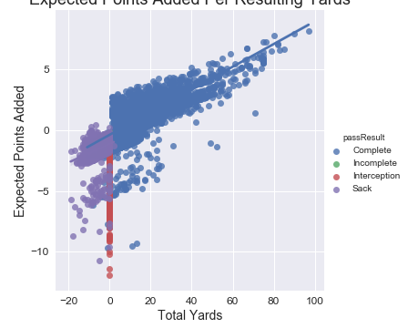
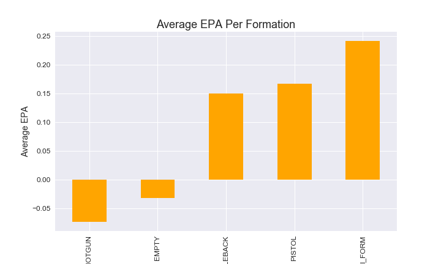
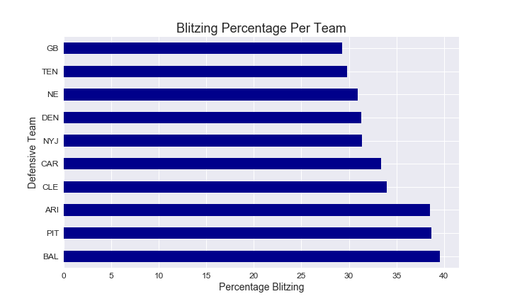
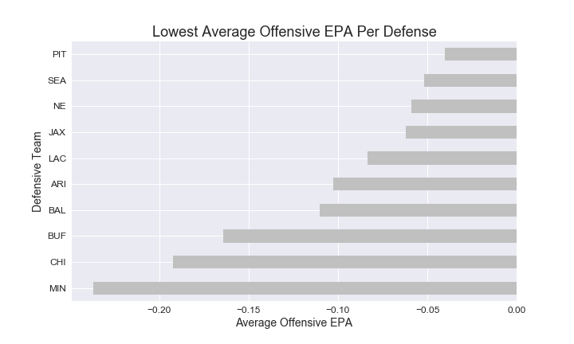
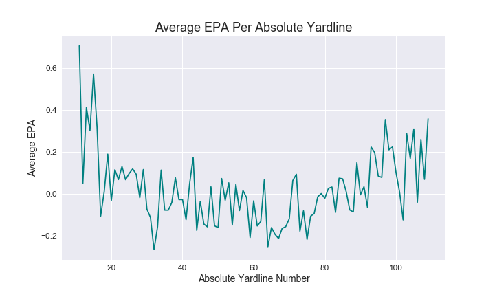

# NFL Passing Success

**Author**: Dave Brown

## Problem

In today's NFL game, much has been made of the pass and the quarterback position. So much so that quarterbacks were taken with the first three picks in the 2021 NFL Draft. This is due to a varity of factors, including explosive college offensive schemes working their way into the NFL. But despite the new focus on the passing game, an increase in passing efficiency hasn't follwed. In the following project, we will take a look at passing results and tendancies for offenses and defenses to determine the best passing conditions.

## Methodology

Two Kaggle datasets from the NFL's 2021 Big Data Bowl that showed details of each matchup and the details of every passing play for the 2018 season. Three tables from the website Pro-Football-Reference.com that showed statistics for passing offenses and defenses for the 2018 season. These datasets were combined, and, along with some engineered features, they 

## Results

Root Mean Squared Error Train:, 0.00345
Root Mean Squared Error Test:, 0.02356
R-Squared Train = 0.97767
R-Squared Test = 0.86249

## Recommendations

1. Use formations that include a running back in the backfield. The defense will have to account for the potential for a run, especially if there is play action.

2. Use the blitz to your advantage. Our findings show that the only a few of the defense's that blitzed the most ranked in the bottom ten of average EPA. Blitzing makes a defense susceptible to a big passing play.

3. Go for a big pass early in the drive. The data shows that average EPA drops as teams go further down the field. It's best to try a big play early if a team wants to best utilize the pass.

## Future Work

1. The model only uses one season's worth of passing plays. With more data, it could become more accurate.
2. Adding more details, like route combinations would enhance the model.
3. Incorporating rushing plays into the dataset could also help find ideal conditions for an explosive passing play.
4. The defensive team's play calls and overall philosphy would add another dimension to the project.
5. This model could potentially become a dashboard for each team's offense.

## For More Information

Please review my full analysis in my [notebook](/plays_notebook.ipynb) and my [presentation](/nfl_passing_success.pdf).

For any additional questions, please contact Dave Brown: davebrown271@gmail.com.

## Repository Structure
#### Main Page
    ├── README.md                              <- The top-level README for reviewers of this project
    ├── plays_notebook.ipynb                   <- The notebook for the analysis
    ├── nfl_passing_success.pdf                <- The presentation
    ├── data                                   <- The folder where existing data was stored
    ├── images                                 <- The folder containing the images used for the presentation
